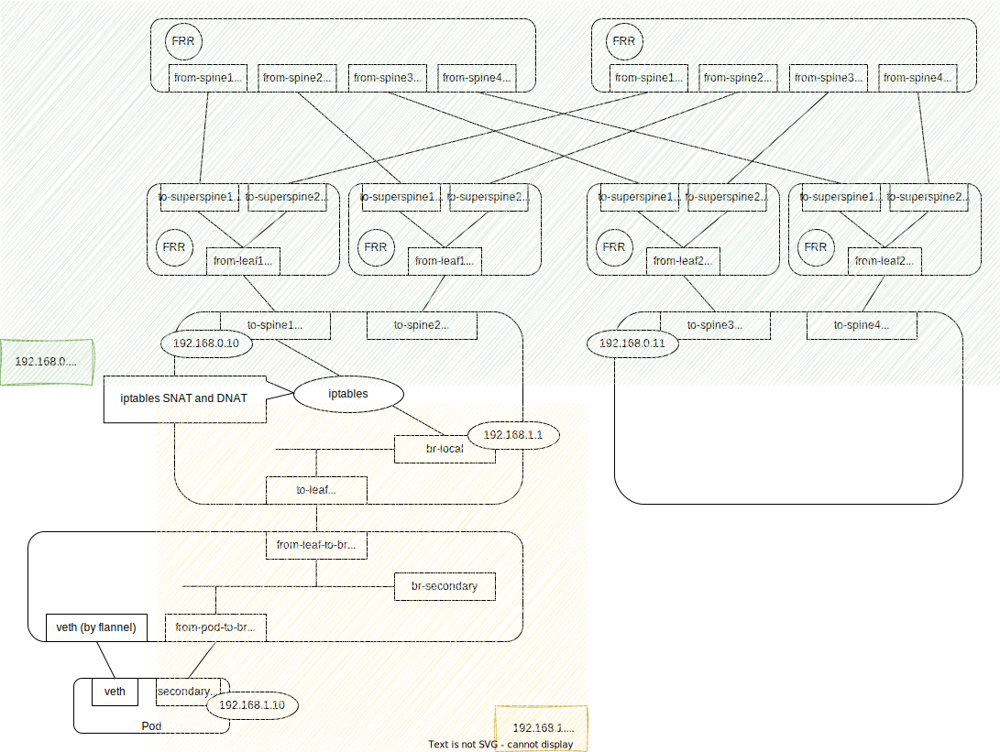

# Development

This document contains how to construct the testbed.
Testbed is the configured as show in the following figure.



This configuration is also applied in Github Action's CI workflow


## Prerequisites

- docker
- kind
- containerlab

### Basic Setup

First of all, create kind cluster with no-CNI

```bash
kind create cluster --name k8sdev --config e2e/manifests/kind-k8sdev-no-cni.yaml
```

After creating cluster, apply flannel CNI manifest and multus CNI manifest.

```bash
# Deploy flannel as a primary CNI
kubectl apply -f e2e/manifests/kube-flannel.yaml
# Deploy multus as a meta plugin
kubectl apply -f e2e/manifests/multus-daemonset-thick.yaml
```

### Create external network

After creating kind cluster, also create external network by containerlab.
Download clab container and execute 'containerlab deploy' command in that container.

```bash
docker pull ghcr.io/srl-labs/clab
docker run --rm -it --privileged \
    --network host \
    -v /var/run/docker.sock:/var/run/docker.sock \
    -v /var/run/netns:/var/run/netns \
    -v /etc/hosts:/etc/hosts \
    -v /var/lib/docker/containers:/var/lib/docker/containers \
    --pid="host" \
    -v $(pwd):$(pwd) \
    -w $(pwd) \
    ghcr.io/srl-labs/clab \
    containerlab deploy --topo e2e/clab/clos.yaml
```

### Configure network by hands


```bash
# Default, ip netns cannot reachout the kind-node's netns because it's not linked to /var/run/netns,
# So, statically link it.
sudo e2e/scripts/setup_kind_netns.sh

# In default network, create veth pair and pass it to 'clab-clos-leaf1' netns and 'k8sdev-worker' netns
sudo ip link add to-leaf type veth peer name from-leaf-to-br
sudo ip link set to-leaf netns clab-clos-leaf1
sudo ip link set from-leaf-to-br netns k8sdev-worker

# In 'clab-clos-leaf1' netns, configure following settings.
# 1. Create bridge 'br-local' and assign veth (to-leaf) from default netns as it's port.
# 2. Assign ip address (192.168.1.1/24) to the bridge. This is the gateway ip of pod's secondary NIC's ip.
# 3. Linkup bridge and veth
sudo ip netns exec clab-clos-leaf1 ip link add br-local type bridge
sudo ip netns exec clab-clos-leaf1 ip link set dev to-leaf master br-local
sudo ip netns exec clab-clos-leaf1 ip addr add 192.168.1.1/24 dev br-local
sudo ip netns exec clab-clos-leaf1 ip link set br-local up
sudo ip netns exec clab-clos-leaf1 ip link set to-leaf up

# 4. Assign ip address that is advertised by BGP(FRR) to the ContainerLab CLOS NW.
sudo ip netns exec clab-clos-leaf1 ip addr add 192.168.0.10/24 dev to-spine1

# 5. Route the traffic from/to pod's secondary subnet (192.168.1.0/24) to/from CLOS subnet (192.168.0.0/24) by iptables.
#    '192.168.1.10' will be assgined to the pod's secondary NIC
sudo ip netns exec clab-clos-leaf1 iptables -t nat -I POSTROUTING -s 192.168.1.10 -j SNAT -o to-spine1 --to-source 192.168.0.10

# 6. Assign ip address that is advertised by BGP(FRR) to the ContainerLab CLOS NW. This is the target IP from pod.
sudo ip netns exec clab-clos-leaf2 ip addr add 192.168.0.11/24 dev to-spine3

# In 'k8sdev-worker' netns, configure following settings.
# 1. Create bridge 'br-secondary' and veth pair 'to-pod' and 'from-pod-to-br'.  
#    'to-pod' veth is used for NetworkAttachDefinition.
# 2. Assign veth 'from-pod-to-br' and 'from-leaf-to-br' (this was created and passed from default netns) to bridge.
# 3. Linkup bridge and veth
sudo ip netns exec k8sdev-worker ip link add br-secondary type bridge
sudo ip netns exec k8sdev-worker ip link add to-pod type veth peer name from-pod-to-br
sudo ip netns exec k8sdev-worker ip link set dev from-pod-to-br master br-secondary
sudo ip netns exec k8sdev-worker ip link set dev from-leaf-to-br master br-secondary
sudo ip netns exec k8sdev-worker ip link set br-secondary up
sudo ip netns exec k8sdev-worker ip link set from-pod-to-br up
sudo ip netns exec k8sdev-worker ip link set from-leaf-to-br up
sudo ip netns exec k8sdev-worker ip link set to-pod up
```

### Check reachability

After above configuraton, prepare NetworkAttachmentDefinition that simply assings this veth to toe pod.  
This NetworkAttachDefinition contains the static route setting for pod's routing table.  
(To confirm that the packet to '192.168.0.11' is send from secondary NIC and it's gateway is 192.168.1.1)

```bash
apiVersion: "k8s.cni.cncf.io/v1"
kind: NetworkAttachmentDefinition
metadata:
  name: net-attach-def-veth01
spec:
  config: '{
      "cniVersion": "0.3.0",
      "type": "host-device",
      "device": "to-pod",
      "ipam": {
        "type": "static",
        "addresses": [
          {
            "address": "192.168.1.10/24",
            "gateway": "192.168.1.1"
          }
        ],
        "routes": [
          { "dst": "192.168.0.0/24", "gw": "192.168.1.1" }
        ]
      }
    }'
```

Create above NetworkAttachmentDefinition and Pod that uses this net-attach-def.  

```bash
kubectl apply -f e2e/manifests/net-attach-def-veth01.yaml
kubectl apply -f e2e/manifests/pod-netshoot-veth01.yaml
```

After the pod status is Running, check reachability from containerlab to pod.

```bash
sudo ip netns exec clab-sample-topology-leaf ping -c 1 192.168.0.11
```
